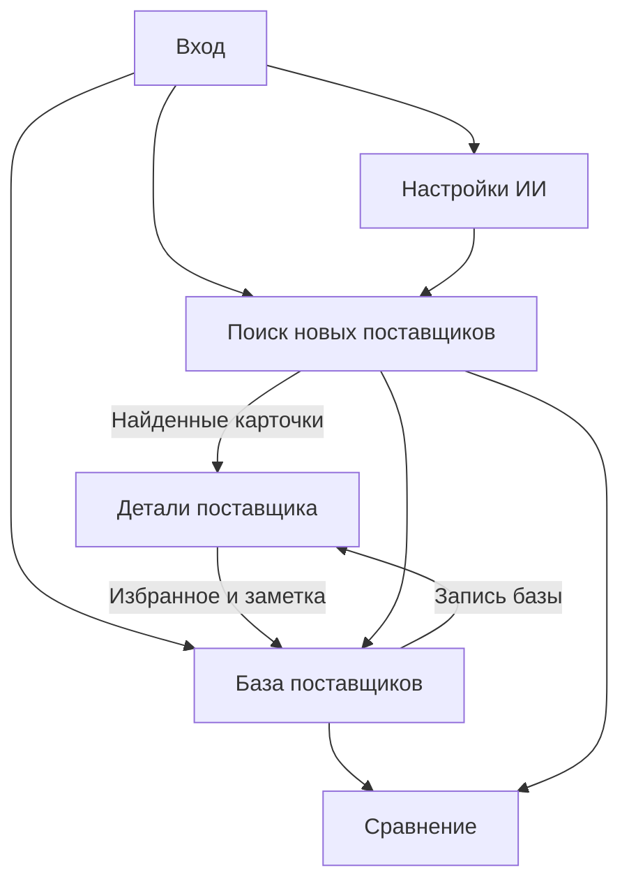
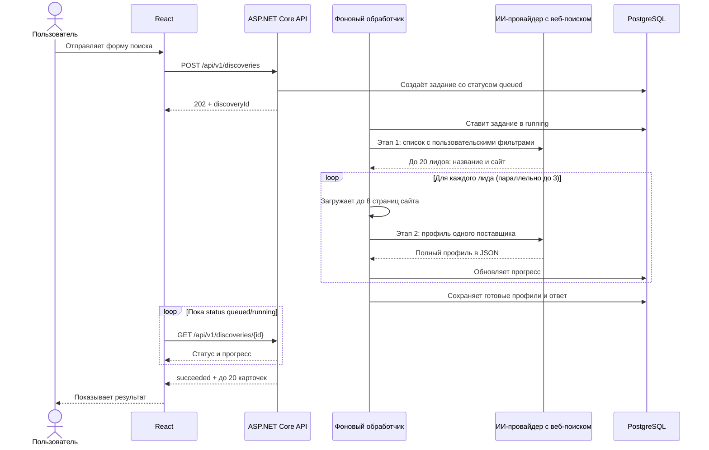
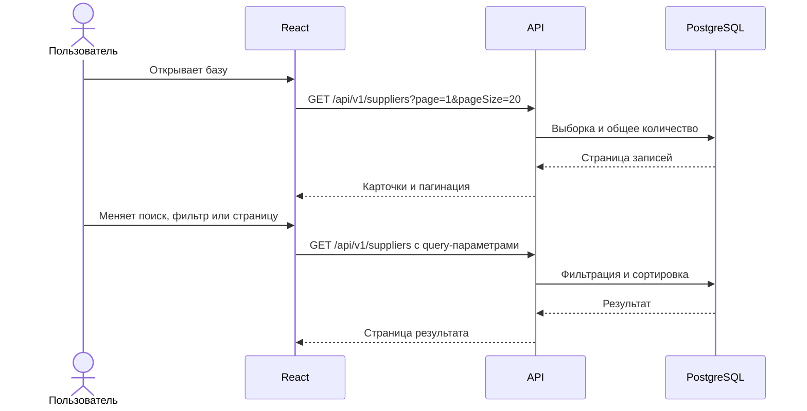
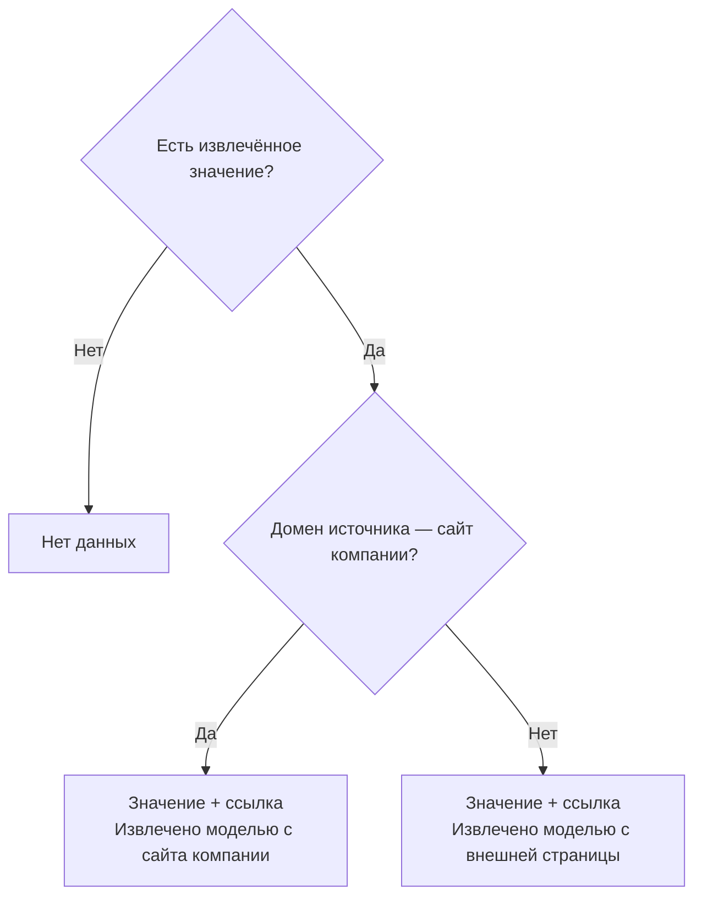

# Схема работы приложения

## 1. Карта пользовательских переходов

Авторизация нужна перед доступом к страницам и API. После первого входа пользователь может настроить провайдера. Сохранённые компании доступны в базе независимо от текущего состояния интеграции.

Сравнение использует локальный список ID и заметок в браузере. Профили для колонок загружаются из существующей базы, а изменения локальной заметки не отправляются на сервер.

## 2. Первый запуск и настройка

1. Docker Compose запускает PostgreSQL, backend и frontend. Backend применяет миграции и открывает API после готовности базы.
2. Пользователь открывает приложение, получает CSRF-токен через `GET /api/v1/auth/csrf` и отправляет пароль администратора в `POST /api/v1/auth/login` с заголовком `X-CSRF-Token`. Backend выдаёт восьмичасовую HttpOnly session-cookie.
3. Страница настроек запрашивает доступные адаптеры и текущую конфигурацию. В текущей версии зарегистрирован Perplexity Sonar с моделями `sonar`, `sonar-pro`, `sonar-deep-research` и `sonar-reasoning-pro`.
4. Пользователь выбирает провайдера и модель, вводит ключ. Frontend отправляет его только в `PUT /api/v1/ai/settings`; опубликованный прототип использует HTTPS, локальная разработка может работать по HTTP на `localhost`.
5. Backend шифрует ключ AES-256-GCM мастер-ключом окружения и сохраняет настройки. Повторный `GET` возвращает только маску и `hasApiKey`.
6. Кнопка «Проверить подключение» вызывает минимальный веб-поиск через провайдера. Успешный ответ подтверждает и соединение, и наличие веб-источника; интерфейс показывает результат или конкретную ошибку без раскрытия секрета.

Если ключ не задан или провайдер не умеет получать актуальные веб-источники, на странице нового поиска выводится переход в настройки. База и детали продолжают работать.

## 3. Поиск новых поставщиков

### 3.1. Поиск кандидатов и исследование сайта

Запуск только по кнопке «Найти»: это дорогая многошаговая операция, поэтому изменение полей не вызывает автоматический поиск. `POST /discoveries` валидирует текст и фильтры, сохраняет запрос как задание со статусом `queued` и сразу возвращает `discoveryId`. Фоновый обработчик переживает перезапуск: при старте подхватывает задания `queued` и повторно ставит в очередь прерванные `running`.

Первый запрос получает исходную формулировку и все пользовательские фильтры как дополнительное описание нужного списка. Он возвращает до 20 кратких лидов: название и сайт. Цены, контакты и иные подробности на этом этапе не запрашиваются. Backend не перепроверяет фильтры после обогащения и не отбрасывает компанию из-за отсутствующих полей.

Для каждого лида отдельный исследователь загружает стартовую страницу сайта и до семи подходящих внутренних страниц (например, «О компании», контакты, каталог, цены, доставка, сертификаты). Он следует только на публичные HTTP(S)-адреса сайта, ограничивает размер ответа и время обхода. Затем отправляется отдельный веб-запрос с названием компании, доменом и собранным текстом; для Perplexity поиск ограничен доменом, для Polza в запрос добавляется `site:<domain>`. Модель возвращает готовый JSON-профиль с описанием, местоположением, контактами, товарами/ценами, условиями поставки, минимальным заказом, регионами, сертификатами и изображениями. Если страниц сайта получить не удалось, второй запрос всё равно может использовать веб-поиск провайдера.

### 3.2. Фильтрация и сохранение

После ответа модельный JSON технически разбирается и переносится в факты поставщика. Backend проверяет безопасные URL и допустимые размеры загружаемых страниц; он не сверяет поля профиля с цитатой, не проводит проверку фактов и не применяет фильтры повторно. Полям присваивается статус `aiGenerated`. Ссылки и сниппеты хранятся на уровне поставщика как справочный контекст, а не как подтверждающие ссылки на отдельные поля.

Если отдельный запрос обогащения падает или не возвращает пригодный JSON, этот профиль учитывается в `failedProfileCount`, а обработка остальных лидов продолжается. Совпавший с уже сохранённым поставщиком профиль обновляет его факты и источники; избранное и заметка остаются без изменений. Факты, справочные источники, товарно-ценовые проекции и итог задания сохраняются транзакционно.

`GET /api/v1/discoveries/{id}` возвращает состояние задания (`queued`, `running`, `succeeded`, `failed`), этап и счётчики. `candidateCount` — число лидов первого ответа, `completedCandidates` — число обработанных профилей, `acceptedCount` — число сохранённых карточек, `failedProfileCount` — число сбоев обогащения. Итог содержит до 20 карточек и `outcome`: `no_candidates`, `complete`, `partial` или `profiles_failed`.

## 4. Работа с базой

На этом пути ИИ-провайдер не вызывается. Если фильтр изменился, номер страницы сбрасывается на 1. Параметры отражаются в URL страницы приложения, чтобы можно было повторить тот же просмотр. Пустой результат показывает сообщение и позволяет сбросить фильтры.

## 5. Детали, избранное и заметки

При переходе по карточке frontend вызывает `GET /suppliers/{id}`. Каждый атрибут отображается по правилу:

Нажатие на избранное вызывает `PUT /suppliers/{id}/favorite`; сохранение общей заметки — `PUT /suppliers/{id}/note`. UI обновляется по подтверждённому ответу сервера. При ошибке прежнее состояние остаётся или восстанавливается, пользователь видит сообщение. Избранное и заметки не редактируются ИИ и не стираются последующим поиском.

## 6. Ошибки и пограничные случаи

| Ситуация | Действие системы |
| --- | --- |
| Пустой запрос и нет фильтров | Запрос не отправляется; видна подсказка |
| Ключ не настроен | Поиск не запускается; переход в настройки |
| Провайдер не отвечает или превышен тайм-аут | Сообщение с возможностью повторить; сведения о поставщиках не меняются, неудачный запуск может фиксироваться в `discovery_runs` |
| Некорректный JSON первого списка | Ошибка `PROVIDER_INVALID_RESPONSE`; поставщики не изменяются, запуск фиксируется в `discovery_runs` |
| Не удалось исследовать сайт или получить профиль лида | Профиль учитывается в `failedProfileCount`; обработчик продолжает остальные запросы и показывает прогресс |
| Нет значения в JSON профиле | Поле сохраняется как `missing`; остальные сведения компании остаются |
| Значение собрано моделью | Статус `aiGenerated` указывает, что факт отдельно не проверялся; ссылки на страницы показаны как справочный контекст поставщика |
| Повторно найден поставщик | Факты обновляются, избранное и заметка сохраняются |
| Цены в разных валютах или единицах | Автоматически не сравниваются; несопоставимая цена не проходит фильтр |
| У внешней фотографии сломалась ссылка | Фото скрывается, остальные сведения остаются доступны |
| Пользователь потерял сессию | Изменения не отправляются; приложение переводит на вход |

## 7. Путь данных от источника до интерфейса

```mermaid
flowchart LR
    U[Запрос + фильтры] --> L[Веб-поиск: список до 20]
    L --> W[Страницы сайта каждого лида]
    W --> P[Веб-поиск профиля]
    P --> J[Полный JSON от модели]
    J --> N[Разбор в факты и нормализация проекций]
    N --> E[Факт aiGenerated + справочные ссылки]
    E --> DB[(PostgreSQL)]
    DB --> API[API деталей]
    API --> UI[Значение / доменный источник / Нет данных]
```

Значение поступает из JSON-профиля модели. Backend преобразует профиль в сущности базы, но не проверяет факты и не фильтрует результат повторно. Публичные URL страниц и сниппеты сохраняются как общий справочный контекст поставщика. Дата последнего сбора помогает оценить свежесть сведений.

## 8. Завершение и демонстрация

Для демонстрации пользователь входит, проверяет интеграцию, ищет поставщиков по категории и региону, открывает детали со статусами полей, добавляет компанию в избранное, затем находит её в локальной базе через фильтр. README описывает этот сценарий, команды запуска через Docker Compose и ограничения источников. Ссылки на прототип и репозиторий, а также краткое объяснение решения отправляются HR после развёртывания.
