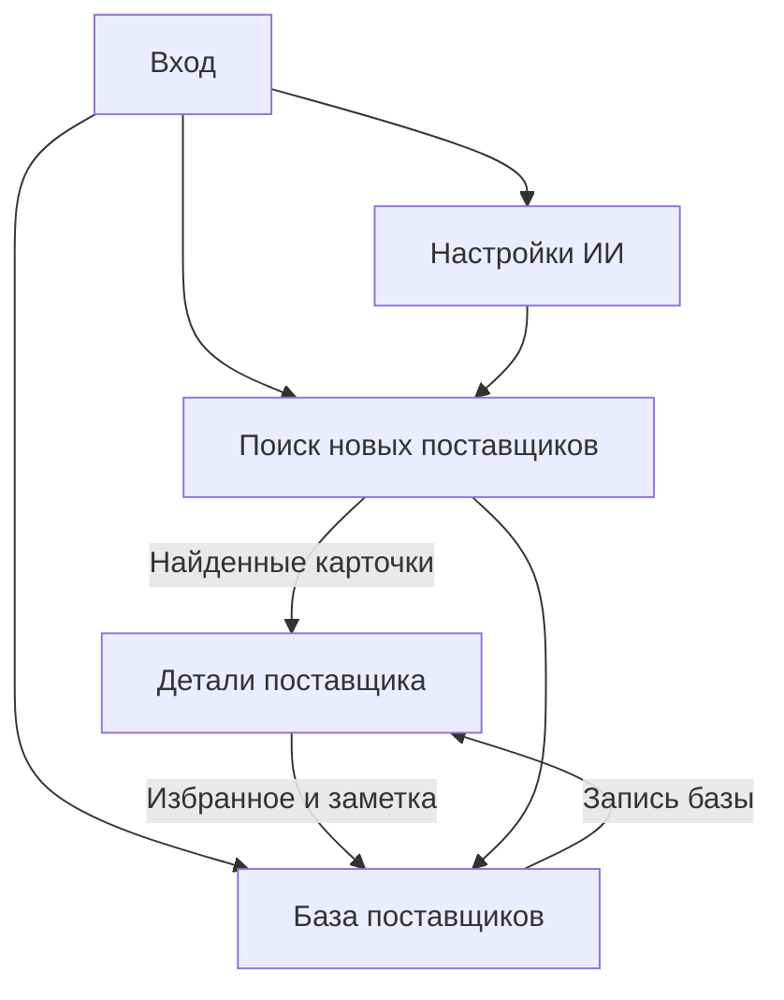
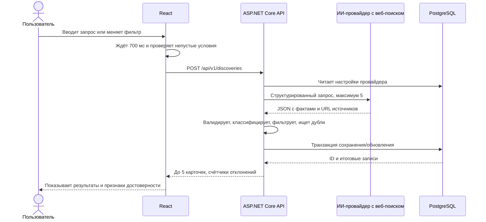
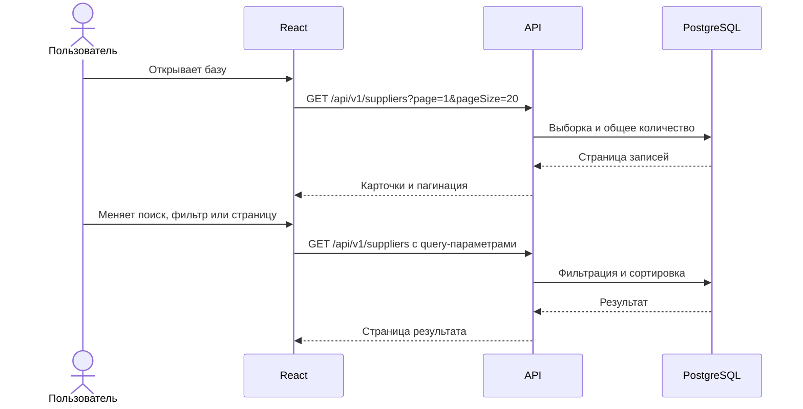
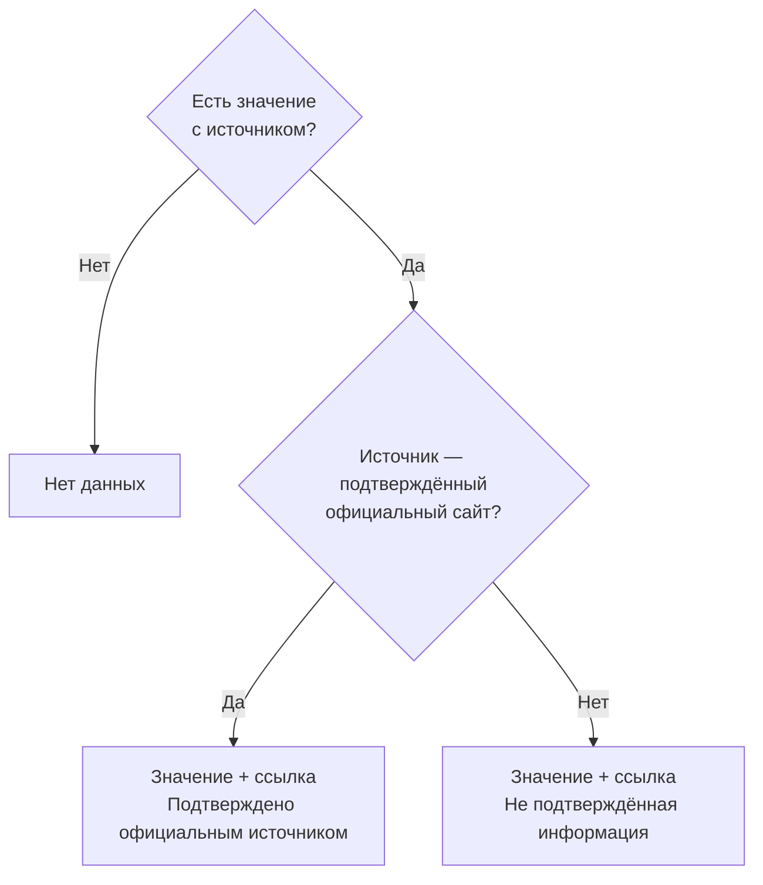
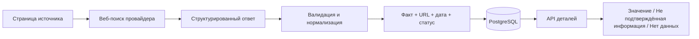

# Схема работы приложения

## 1. Карта пользовательских переходов

Авторизация нужна перед доступом к страницам и API. После первого входа пользователь может настроить провайдера. Сохранённые компании доступны в базе независимо от текущего состояния интеграции.

## 2. Первый запуск и настройка

1. Docker Compose запускает PostgreSQL, backend и frontend. Backend применяет миграции и открывает API после готовности базы.
2. Пользователь открывает приложение, получает CSRF-токен и входит с паролем администратора.
3. Страница настроек запрашивает доступные адаптеры и текущую конфигурацию.
4. Пользователь выбирает провайдера и модель, вводит ключ. Frontend отправляет его только в `PUT /api/v1/ai/settings`; опубликованный прототип использует HTTPS, локальная разработка может работать по HTTP на `localhost`.
5. Backend шифрует ключ и сохраняет настройки. Повторный `GET` возвращает только маску и `hasApiKey`.
6. Кнопка «Проверить подключение» вызывает минимальный запрос к провайдеру. Интерфейс показывает результат или конкретную ошибку без раскрытия секрета.

Если ключ не задан или провайдер не умеет получать актуальные веб-источники, на странице нового поиска выводится переход в настройки. База и детали продолжают работать.

## 3. Поиск новых поставщиков

### 3.1. Формирование запроса

Frontend не вызывает API для пустой формы. При изменении текста или фильтров сбрасывает таймер 700 мс. Кнопка «Найти» запускает тот же сценарий немедленно. Пока запрос выполняется, повторный автоматический запуск не отправляется; если пользователь изменил условия, устаревший ответ игнорируется и после завершения/отмены запускается поиск по последним условиям.

Backend проверяет параметры и доступность интеграции. Текст и фильтры превращаются в отдельные поля промпта и структурированного запроса провайдера. Для объёма минимального заказа можно задать нижнюю и/или верхнюю границу с единицей измерения. Ценовой фильтр по умолчанию учитывает только точные цены; примерные включаются отдельным параметром и всегда маркируются в интерфейсе «ориентировочно». Инструкция требует реальных компаний, до пяти результатов, источника для названия и каждого значения, а также `null` вместо догадок. Размер ответа ограничен; выходная JSON-схема проверяется до работы с БД.

### 3.2. Обработка ответа

Для каждой записи backend:

1. Проверяет название, хотя бы одну страницу источника, допустимость URL и длину полей.
2. Нормализует официальный домен, название, местоположение, категории, денежные суммы и единицы.
3. Сопоставляет название и каждое значение с URL и фрагментом страницы, предоставленными инструментом веб-поиска. Значение с подтверждённого официального домена получает `official`; со сторонней страницы — `external`; без прослеживаемого источника отбрасывается и в интерфейсе становится `missing`.
4. Применяет заданные пользователем условия. Неизвестные и несопоставимые значения не проходят соответствующий фильтр; минимальный заказ должен попадать в заданный диапазон. Примерные цены учитываются только при явном включении в фильтре.
5. Ищет запись по официальному домену. Если новый домен не найден, проверяет кандидата без домена по названию и региону; если домена у нового результата нет, проверяет совпадение названия и региона среди всех записей. Неоднозначные или противоречащие совпадения не сливает автоматически.
6. Создаёт или обновляет компанию, факты и источники, сохраняя общее для базы избранное и заметку.

Записи, не прошедшие валидацию или условия поиска, считаются в `rejectedCount`. Из прошедших обе проверки выбираются максимум пять; ответ страницы формируется из уже сохранённых данных. Подходящие записи сверх лимита не считаются отклонёнными. Если несколько источников расходятся, факты сохраняются раздельно; основное значение берётся из официального источника, альтернативы остаются видны в деталях.

## 4. Работа с базой

На этом пути ИИ-провайдер не вызывается. Если фильтр изменился, номер страницы сбрасывается на 1. Параметры отражаются в URL страницы приложения, чтобы можно было повторить тот же просмотр. Пустой результат показывает сообщение и позволяет сбросить фильтры.

## 5. Детали, избранное и заметки

При переходе по карточке frontend вызывает `GET /suppliers/{id}`. Каждый атрибут отображается по правилу:

Нажатие на избранное вызывает `PUT /suppliers/{id}/favorite`; сохранение общей заметки — `PUT /suppliers/{id}/note`. UI обновляется по подтверждённому ответу сервера. При ошибке прежнее состояние остаётся или восстанавливается, пользователь видит сообщение. Избранное и заметки не редактируются ИИ и не стираются последующим поиском.

## 6. Ошибки и пограничные случаи

| Ситуация | Действие системы |
| --- | --- |
| Пустой запрос и нет фильтров | Запрос не отправляется; видна подсказка |
| Ключ не настроен | Поиск не запускается; переход в настройки |
| Провайдер не отвечает или превышен тайм-аут | Сообщение с возможностью повторить; сведения о поставщиках не меняются, неудачный запуск может фиксироваться в `discovery_runs` |
| Некорректный общий JSON | Ошибка `PROVIDER_INVALID_RESPONSE`; сведения о поставщиках не меняются, неудачный запуск может фиксироваться в `discovery_runs` |
| Отдельные невалидные записи | Они пропускаются, валидные сохраняются, число пропусков показывается |
| Источника для факта нет | Факт не сохраняется; в деталях «Нет данных» |
| Сведения только со стороннего сайта | Факт сохраняется со статусом `external` и заметной маркировкой |
| Повторно найден поставщик | Факты обновляются, избранное и заметка сохраняются |
| Цены в разных валютах или единицах | Автоматически не сравниваются; несопоставимая цена не проходит фильтр |
| У внешней фотографии сломалась ссылка | Фото скрывается, остальные сведения остаются доступны |
| Пользователь потерял сессию | Изменения не отправляются; приложение переводит на вход |

## 7. Путь данных от источника до интерфейса

Значение считается пригодным для отображения только вместе с конкретным URL. Сам факт ответа модели не является источником. Дата последнего сбора показана пользователю, чтобы он мог оценить свежесть и перейти к первоисточнику.

## 8. Завершение и демонстрация

Для демонстрации пользователь входит, проверяет интеграцию, ищет поставщиков по категории и региону, открывает детали со статусами полей, добавляет компанию в избранное, затем находит её в локальной базе через фильтр. README описывает этот сценарий, команды запуска через Docker Compose и ограничения источников. Ссылки на прототип и репозиторий, а также краткое объяснение решения отправляются HR после развёртывания.
