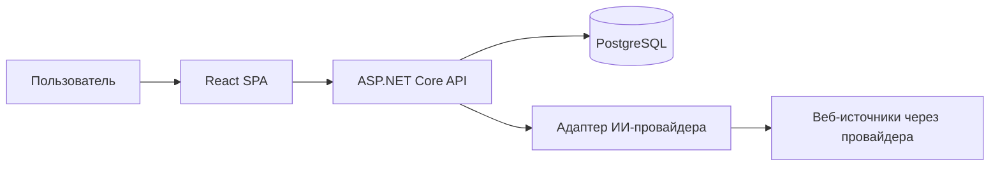

# Архитектура приложения

## 1. Общая схема



Frontend не обращается к ИИ-провайдеру и базе напрямую. Backend владеет проверкой входных данных, промптом, ключом, нормализацией ответа, дедупликацией и сохранением. Сторонний веб-поиск выполняется провайдером с соответствующей возможностью; произвольные веб-страницы backend в первой версии не парсит.

## 2. Состав репозитория

Рекомендуемая структура:

```text
backend/
  Api/                  HTTP endpoints, DTO, auth, middleware
  Application/          сценарии поиска, фильтрации, обновления
  Domain/               сущности и правила достоверности
  Infrastructure/       EF Core, PostgreSQL, шифрование, адаптеры ИИ
frontend/
  src/pages/            поиск, база, детали, настройки, вход
  src/features/         формы, фильтры, карточки, избранное
  src/shared/           API client, типы, UI
docs/                   ТЗ, архитектура, API, схема работы
compose.yaml
.env.example
README.md
```

Это логическое разделение; отдельные .NET-проекты допустимы, если оно не усложнит прототип.

## 3. Backend

### 3.1. HTTP-слой

ASP.NET Core Web API предоставляет маршруты `/api/v1/*` из [api-contracts.md](api-contracts.md). DTO отделены от EF-сущностей. На входе проверяются длина строк, диапазоны чисел, формат URL, допустимые enum-значения и размер страницы. Ошибки возвращаются единым форматом Problem Details с кодом приложения. OpenAPI генерируется из фактических маршрутов и DTO.

Для публично доступного прототипа используется один администратор. Начальный пароль задаётся секретом окружения; вход выдаёт защищённую `HttpOnly` cookie с `SameSite=Lax` и `Secure` в опубликованном HTTPS-окружении. Изменяющие запросы дополнительно защищены CSRF-токеном. Все маршруты данных и настроек требуют авторизации; отдельный маршрут проверки готовности доступен инфраструктуре. Продакшен-развёртывание обслуживается по HTTPS через reverse proxy.

### 3.2. Сценарий поиска

`SupplierDiscoveryService` принимает валидированный `DiscoveryRequest`, ограничивает объём ответа пятью, формирует запрос провайдеру и вызывает адаптер. Адаптер обязан поддерживать актуальный поиск и возврат URL источников. Выбор провайдера и модели берётся из сохранённых настроек. Промпт содержит условия пользователя, JSON-схему и запрет на домысливание неизвестных данных. Структурированный ответ провайдера считается недоверенным входом.

После ответа выполняются:

1. Проверка размера и JSON-схемы.
2. Нормализация текста, доменов, URL, городов и категорий.
3. Удаление записей без подтверждённого названия или страницы источника.
4. Сопоставление значения с фрагментом страницы, полученным инструментом веб-поиска, и классификация доказательств по домену официального сайта поставщика.
5. Проверка условий поиска по сопоставимым значениям и выбор не более пяти подходящих записей.
6. Поиск дублей и обновление данных в транзакции.
7. Формирование ответа с карточками и числом записей, отклонённых валидацией или фильтрами.

Ограничение времени внешнего вызова — конфигурируемое, значение по умолчанию 45 секунд. Максимум результата — пять поставщиков; число попыток повторного запроса при временном сбое — не более одной и только до начала сохранения. При тайм-ауте сведения о поставщиках не меняются; неудачный запуск можно зафиксировать отдельно в `discovery_runs`. Отмена HTTP-запроса передаётся провайдеру, если его SDK позволяет.

### 3.3. Провайдеры

Интерфейс `ISupplierDiscoveryProvider` скрывает особенности конкретного API: `DiscoverAsync(query, filters, limit, cancellationToken)`. Для первой версии нужен как минимум один работающий адаптер к провайдеру с веб-поиском. Настройки содержат идентификатор адаптера, модель и зашифрованный ключ. Список доступных адаптеров задаётся сервером; ввод произвольного URL API через UI не предусмотрен. Это ограничивает утечку ключа на неизвестный хост.

Проверка подключения выполняет минимальный запрос через выбранный адаптер и проверяет возможность получения источников. Ошибка проверки не удаляет сохранённые настройки. При смене провайдера старый ключ удаляется или заменяется в явном действии пользователя.

## 4. Модель данных

Идентификаторы — UUID, даты — UTC (`timestamptz`). Основные таблицы:

| Таблица | Основные поля | Назначение |
| --- | --- | --- |
| `suppliers` | `id`, `name`, `normalized_name`, `official_site_url`, `official_domain`, `city`, `region`, `is_favorite`, `note`, `created_at`, `updated_at`, `last_discovered_at` | Сводная запись и пользовательские данные |
| `supplier_facts` | `id`, `supplier_id`, `field_key`, `item_key`, `value_json`, `verification_status`, `observed_at`, `is_current` | Значения всех внешних полей, включая описание, адрес, контакты, регионы и доставку |
| `fact_sources` | `fact_id`, `source_id` | Связь факта с его источниками |
| `supplier_sources` | `id`, `supplier_id`, `url`, `host`, `title`, `excerpt`, `source_type`, `retrieved_at` | Конкретные страницы и короткие фрагменты, на которых найден факт |
| `supplier_products` | `id`, `supplier_id`, `name`, `category`, `normalized_name` | Товары для поиска и фильтрации |
| `supplier_prices` | `id`, `product_id`, `amount_min`, `amount_max`, `currency`, `unit`, `is_approximate`, `fact_id` | Цена как отдельное сопоставимое значение |
| `supplier_images` | `id`, `supplier_id`, `url`, `fact_id`, `sort_order` | Ссылки на изображения с источником |
| `discovery_runs` | `id`, `query_json`, `started_at`, `finished_at`, `status`, `accepted_count`, `rejected_count`, `error_code` | Диагностика запусков без хранения секретов |
| `ai_provider_settings` | `id`, `provider_id`, `model`, `encrypted_api_key`, `updated_at` | Одна активная конфигурация |

`field_key` определяет тип факта: `name`, `description`, `address`, `city`, `region`, `phone`, `email`, `website`, `delivery_terms`, `delivery_days`, `minimum_order`, `certificate`, `service_region`, `product_name`, `product_category` и т. п. Для повторяющихся значений `item_key` различает элементы. Товар и его категория связываются с подтверждающими фактами через общий `item_key`; `supplier_products` служит индексируемой проекцией этих фактов для поиска. Сводное поле `suppliers.name` хранит выбранное актуальное значение для поиска и карточек, а происхождение и статус названия хранятся как факт `name` в `supplier_facts`. Отсутствие факта означает `missing`, запись с выдуманным текстом «Нет данных» не создаётся. Для удобства поиска отдельные индексируемые столбцы `city`, `region`, `official_domain` и таблицы товаров/цен поддерживаются в одной транзакции с фактами.

Статус факта:

- `official`: ссылка на конкретную страницу принадлежит проверенному официальному домену компании;
- `external`: есть конкретная страница стороннего домена, но официального подтверждения нет;
- `missing`: вычисляется API при отсутствии актуального факта.

Если официальный сайт компании ещё не определён, его домен нельзя вывести только из утверждения модели. Адрес официального сайта принимается при наличии подтверждающего источника, связывающего сайт с компанией; до такой проверки данные остаются `external`. Домен сравнивается с учётом поддоменов и публичных суффиксов. Факт должен быть прослеживаем до фрагмента страницы, возвращённого инструментом веб-поиска отдельно от генерации модели; URL без фрагмента не подтверждает значение. Сохранённый короткий фрагмент нужен для аудита, но пользователю показывается ссылка на первоисточник. Несовпадающие значения из разных источников хранятся как отдельные факты; `is_current` и приоритет официального источника определяют основное отображаемое значение. Сохранение новых данных не затрагивает `is_favorite` и `note`.

Индексы: уникальный индекс по непустому `official_domain`; индекс по `(normalized_name, region)` для поиска кандидатов без домена; индексы по `is_favorite`, `created_at`, `city`, категориям и нормализованному имени товара. При появлении подтверждённого домена сначала ищется запись по домену, затем проверяется кандидат с тем же названием и регионом без домена: его домен дополняется при отсутствии противоречащих признаков компании. Для входящей записи без домена совпадение названия и региона проверяется среди всех записей, а противоречащие идентифицирующие признаки требуют ручного разбора вместо автоматического слияния. Для текстового поиска допустим PostgreSQL full text или `pg_trgm`, без внешнего поискового сервиса. Миграции EF Core — единственный способ изменения схемы.

## 5. Frontend

React + TypeScript и клиентский маршрутизатор: `/login`, `/discover`, `/suppliers`, `/suppliers/:id`, `/settings/integration`. Компонент фильтров используется обеими страницами, но отправляет запросы в разные endpoints. Поиск новых поставщиков хранит введённые параметры и последнее состояние в памяти страницы; база использует URL query-параметры для воспроизводимых фильтров и пагинации.

API-клиент централизует обработку ошибок, отмену запросов, cookie и CSRF. На странице поиска debounce 700 мс и `AbortController` не допускают перезаписи новых результатов устаревшим ответом. В деталях компонент `SourcedField` одинаково показывает `official`, `external` и `missing`. Ссылки на внешние сайты открываются безопасно (`rel="noopener noreferrer"`).

## 6. Развёртывание и наблюдаемость

`compose.yaml` поднимает PostgreSQL с постоянным volume, backend и frontend/reverse proxy. Backend ждёт готовности базы и применяет миграции при старте либо отдельной командой в инструкции. Конфигурация задаётся `.env` по образцу `.env.example`; реальные значения не коммитятся. Нужны переменные подключения к БД, мастер-ключ шифрования, пароль администратора и адрес приложения. Для локальной разработки допускается HTTP на `localhost`, опубликованный прототип использует HTTPS.

Логи содержат идентификатор запроса, время поиска, провайдера, количество принятых/отклонённых записей и код ошибки. Ключи, cookie, содержимое заметок и полный ответ модели не журналируются. `GET /api/v1/health/ready` проверяет готовность backend и базы. Резервное копирование PostgreSQL и ротация ключа описываются в README для дальнейшей эксплуатации.

## 7. Основные решения и ограничения

- Веб-поиск провайдера — внешний зависимый компонент; доступность, стоимость и качество поиска зависят от его тарифа и модели.
- Сторонние сведения помечаются; наличие URL не гарантирует актуальность цены и условий.
- Изображения не скачиваются и не копируются, а показываются по исходным URL; недоступный URL скрывается с запасным оформлением.
- Фильтрация по срокам, цене и объёму производится только для значений с сопоставимыми единицами; автоматическая конвертация валют и единиц не входит в первую версию.
- Избранное и заметки общие для единственной учётной записи. Многопользовательский режим потребует отдельной модели владельцев и прав.
