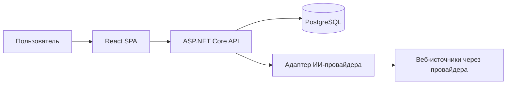

# Архитектура приложения

## 1. Общая схема



Frontend не обращается к ИИ-провайдеру и базе напрямую. Backend владеет проверкой входных данных, промптом, ключом, нормализацией ответа, дедупликацией и сохранением. Сторонний веб-поиск выполняется провайдером с соответствующей возможностью; произвольные веб-страницы backend в первой версии не парсит.

## 2. Состав репозитория

Рекомендуемая структура:

```text
backend/
  Api/                  HTTP endpoints, DTO, auth, middleware, adapters провайдера
  Application/          сценарии поиска, фильтрации, обновления
  Domain/               сущности и правила достоверности
  Infrastructure/       EF Core, PostgreSQL, транзакции и миграции
frontend/
  src/pages/            поиск, база, детали, настройки, вход
  src/features/         формы, фильтры, карточки, избранное
  src/shared/           API client, типы, UI
docs/                   ТЗ, архитектура, API, схема работы
compose.yaml
.env.example
README.md
```

Это логическое разделение; отдельные .NET-проекты допустимы, если оно не усложнит прототип.

## 3. Backend

### 3.1. HTTP-слой

ASP.NET Core Web API предоставляет маршруты `/api/v1/*` из [api-contracts.md](api-contracts.md). DTO отделены от EF-сущностей. На входе проверяются длина строк, диапазоны чисел, формат URL, допустимые enum-значения и размер страницы. Ошибки возвращаются единым форматом Problem Details с кодом приложения. OpenAPI генерируется из фактических маршрутов и DTO.

Для публично доступного прототипа используется один администратор. Начальный пароль задаётся секретом окружения `Admin:InitialPassword` и должен содержать не менее 12 символов. Вход выдаёт защищённую восьмичасовую `HttpOnly` cookie с `SameSite=Lax` и `Secure` вне среды разработки. Изменяющие API-запросы дополнительно защищены ASP.NET Core antiforgery-токеном из `X-CSRF-Token`, включая вход. Вход ограничен пятью попытками за 15 минут на IP. Все маршруты данных и настроек требуют авторизации; отдельный маршрут проверки готовности доступен инфраструктуре. Продакшен-развёртывание обслуживается по HTTPS через reverse proxy.

### 3.2. Сценарий поиска

`SupplierDiscoveryService` передаёт текст и все фильтры в первый веб-запрос, который находит до 20 лидов. Для каждого лида приложение читает до восьми публичных страниц его сайта и делает отдельный веб-запрос, возвращающий полный JSON-профиль. Профили запрашиваются параллельно, максимум три одновременно. `DiscoveryBackgroundWorker` выполняет задания и фиксирует прогресс в `discovery_runs`; API возвращает `202` и `discoveryId`, frontend опрашивает состояние.

После ответов выполняются:

1. Разбор первого списка и каждого профильного JSON по своим схемам.
2. Загрузка страниц с проверкой публичного HTTP(S)-URL, домена, тайм-аута и размера ответа.
3. Перенос полей профиля в сущности; факты получают статус `aiGenerated` и не сопоставляются с цитатами.
4. Нормализация значений для индексируемых товарно-ценовых проекций.
5. Поиск уже сохранённого поставщика по домену либо нормализованному названию и обновление в транзакции.
6. Сохранение справочных ссылок на страницы и результата задания.
7. Учёт сбоев отдельных профилей в `failed_profile_count`; успешные профили сохраняются независимо.

Запрос провайдера ограничен настраиваемым тайм-аутом, по умолчанию 45 секунд. В одном запуске до 20 лидов; страницы каждого сайта загружаются до 35 секунд, максимум восемь страниц по 512 KiB каждая. Ошибка первого запроса завершает запуск; ошибка отдельного профильного запроса не мешает остальным. Отмена передаётся провайдеру вместе с отменой фонового задания.

### 3.3. Провайдеры

Интерфейс `ISupplierDiscoveryProvider` скрывает особенности конкретного API: `DiscoverAsync(query, filters, limit, cancellationToken)`. Реализован Perplexity Sonar API с моделями `sonar`, `sonar-pro`, `sonar-deep-research` и `sonar-reasoning-pro`; его идентификатор — `perplexity`, рекомендуемая модель — `sonar-pro`. Отдельный адаптер проверяет соединение и доступность веб-поиска через `IAiProviderAdapter.CheckConnectionAsync(model, apiKey, cancellationToken)`. Настройки содержат идентификатор адаптера, модель и зашифрованный ключ. Ключ шифруется AES-256-GCM с 32-байтовым Base64 секретом окружения `Ai:EncryptionKey`; список доступных адаптеров задаётся сервером и исключает те, которые не поддерживают веб-поиск. Ввод произвольного URL API через UI не предусмотрен. Это ограничивает утечку ключа на неизвестный хост.

Первый запрос получает список, дальнейшие запросы строят отдельные JSON-профили. Профильный запрос Perplexity ограничивает результаты доменом сайта через `search_domain_filter`; Polza получает оператор `site:` в web plugin. Приложение передаёт модели до восьми предварительно загруженных страниц. Ссылки и сниппеты сохраняются как общий контекст поставщика; backend не сопоставляет их с полями профиля и не применяет фильтры после обогащения. HTTP-ответы провайдера имеют лимит размера 2 MiB и настраиваемый тайм-аут (45 секунд по умолчанию).

Проверка подключения выполняет отдельный минимальный запрос через выбранный адаптер и проверяет доступность веб-поиска. Ошибка проверки не удаляет сохранённые настройки. При смене провайдера старый ключ удаляется или заменяется в явном действии пользователя.

## 4. Модель данных

Идентификаторы — UUID, даты — UTC (`timestamptz`). Основные таблицы:

| Таблица | Основные поля | Назначение |
| --- | --- | --- |
| `suppliers` | `id`, `name`, `normalized_name`, `official_site_url`, `official_domain`, `city`, `region`, `is_favorite`, `note`, `created_at`, `updated_at`, `last_discovered_at` | Сводная запись и пользовательские данные |
| `supplier_facts` | `id`, `supplier_id`, `field_key`, `item_key`, `value_json`, `verification_status`, `observed_at`, `is_current` | Значения всех внешних полей, включая описание, адрес, контакты, регионы и доставку |
| `fact_sources` | `fact_id`, `source_id` | Связь факта с его источниками |
| `supplier_sources` | `id`, `supplier_id`, `url`, `host`, `title`, `excerpt`, `source_type`, `retrieved_at` | Конкретные страницы и короткие фрагменты, на которых найден факт |
| `supplier_products` | `id`, `supplier_id`, `name`, `category`, `normalized_name` | Товары для поиска и фильтрации |
| `supplier_prices` | `id`, `product_id`, `amount_min`, `amount_max`, `currency`, `unit`, `is_approximate`, `fact_id` | Цена как отдельное сопоставимое значение |
| `supplier_images` | `id`, `supplier_id`, `url`, `fact_id`, `sort_order` | Ссылки на изображения с источником |
| `discovery_runs` | `id`, `query_json`, `started_at`, `finished_at`, `status`, `accepted_count`, `failed_profile_count`, `error_code` | Диагностика запусков без хранения секретов |
| `ai_provider_settings` | `id`, `provider_id`, `model`, `encrypted_api_key`, `updated_at` | Одна активная конфигурация |

`field_key` определяет тип факта: `name`, `description`, `address`, `city`, `region`, `phone`, `email`, `website`, `delivery_terms`, `delivery_days`, `minimum_order`, `certificate`, `service_region`, `product_name`, `product_category` и т. п. Для повторяющихся значений `item_key` различает элементы. Товар и его категория связываются с подтверждающими фактами через общий `item_key`; `supplier_products` служит индексируемой проекцией этих фактов для поиска. Сводное поле `suppliers.name` хранит выбранное актуальное значение для поиска и карточек, а происхождение и статус названия хранятся как факт `name` в `supplier_facts`. Отсутствие факта означает `missing`, запись с выдуманным текстом «Нет данных» не создаётся. Для удобства поиска отдельные индексируемые столбцы `city`, `region`, `official_domain` и таблицы товаров/цен поддерживаются в одной транзакции с фактами.

Статус факта:

- `official`: старые или вручную сохранённые данные, помеченные как относящиеся к домену сайта компании;
- `external`: старые данные, связанные с внешней страницей;
- `aiGenerated` (`ai_generated` в БД): профиль, возвращённый моделью без отдельной проверки фактов;
- `missing`: вычисляется API при отсутствии актуального факта.

Новый алгоритм не назначает источники отдельным фактам и не заявляет, что конкретная страница подтверждает отдельное значение. URL страниц и сниппеты хранятся в общем списке источников поставщика. Новые значения модели становятся текущими при повторном поиске; `is_favorite` и `note` не меняются.

Индексы: уникальный индекс по непустому `official_domain`; индекс по `(normalized_name, region)` для поиска кандидатов без домена; индексы по `is_favorite`, `created_at`, `city`, категориям и нормализованному имени товара. При появлении подтверждённого домена сначала ищется запись по домену, затем проверяется кандидат с тем же названием и регионом без домена: его домен дополняется при отсутствии противоречащих признаков компании. Для входящей записи без домена совпадение названия и региона проверяется среди всех записей, а противоречащие идентифицирующие признаки требуют ручного разбора вместо автоматического слияния. Для текстового поиска допустим PostgreSQL full text или `pg_trgm`, без внешнего поискового сервиса. Миграции EF Core — единственный способ изменения схемы.

## 5. Frontend

React + TypeScript и клиентский маршрутизатор: `/login`, `/discover`, `/suppliers`, `/suppliers/:id`, `/compare`, `/settings/integration`. Все страницы, кроме входа, защищены авторизацией. Компонент фильтров используется поиском и базой, но отправляет запросы в разные endpoints. Поиск новых поставщиков хранит введённые параметры и последнее состояние в памяти страницы; база использует URL query-параметры для воспроизводимых фильтров и пагинации.

Сравнение реализовано на клиенте и не добавляет API-контрактов или таблиц базы. Состояние хранится в `localStorage` под ключом `goulash:supplier-comparison:v1`: `supplierIds` задаёт порядок и состав сравнения, `notes` содержит локальные заметки по ID поставщика. Поставщик добавляется из карточки на `/discover` или `/suppliers`; ID уникальны. Состояние разделяется между вкладками одного origin событием `storage`. При удалении поставщика из базы через список его ID и локальная заметка удаляются из сравнения. Повреждённое или недоступное хранилище не блокирует интерфейс: сравнение продолжает работать в памяти текущей вкладки.

Страница `/compare` загружает подробные профили существующим `GET /api/v1/suppliers/{id}`; это чтение, данные сравнения и изменения заметок в API не отправляются. Таблица показывает название, сайт и контакты, адрес/город/регион/регионы работы, товары и категории, доставку/срок/минимальный заказ, сертификаты и заметку. Цена отдельной строкой не выводится. В ячейках без значения показывается «Нет данных». Заметка сначала берётся из профиля поставщика, а после первого редактирования сохраняется в `localStorage` и больше не синхронизируется с общей заметкой в базе; удаление поставщика из сравнения удаляет и её.

Колонка параметров имеет ширину 150 px, колонка каждого поставщика — минимум 600 px. Таблица прокручивается по горизонтали и вертикали внутри доступной высоты окна, поэтому прокрутка страницы не нужна. Заголовок закреплён сверху при вертикальной прокрутке таблицы, колонка параметров закреплена слева при горизонтальной. При пустом списке страница предлагает перейти в базу. Если профиль недоступен, остальные колонки остаются видимыми; недоступную запись можно убрать крестиком. Пункт меню «Сравнение» показывает числовой счётчик только при наличии выбранных поставщиков.

API-клиент централизует обработку ошибок, отмену запросов, cookie и CSRF. На странице поиска debounce 700 мс и `AbortController` не допускают перезаписи новых результатов устаревшим ответом. В деталях компонент `SourcedField` показывает `aiGenerated`, статусы ранее сохранённых данных и `missing`. Ссылки на внешние сайты открываются безопасно (`rel="noopener noreferrer"`).

## 6. Развёртывание и наблюдаемость

`compose.yaml` поднимает PostgreSQL с постоянным volume, backend и frontend/reverse proxy. Backend ждёт готовности базы и применяет миграции при старте либо отдельной командой в инструкции. Конфигурация задаётся `.env` по образцу `.env.example`; реальные значения не коммитятся. Нужны переменные подключения к БД, мастер-ключ шифрования, пароль администратора и адрес приложения. Для локальной разработки допускается HTTP на `localhost`, опубликованный прототип использует HTTPS.

Логи содержат идентификатор запроса, время поиска, провайдера, число сохранённых карточек, число неудачных профильных запросов и код ошибки. Ключи, cookie, содержимое заметок и полный ответ модели не журналируются. `GET /api/v1/health/ready` проверяет готовность backend и базы. Резервное копирование PostgreSQL и ротация ключа описываются в README для дальнейшей эксплуатации.

## 7. Основные решения и ограничения

- Веб-поиск провайдера — внешний зависимый компонент; доступность, стоимость и качество поиска зависят от его тарифа и модели.
- Сторонние сведения помечаются; наличие URL не гарантирует актуальность цены и условий.
- Изображения не скачиваются и не копируются, а показываются по исходным URL; недоступный URL скрывается с запасным оформлением.
- Фильтрация по срокам, цене и объёму производится только для значений с сопоставимыми единицами; автоматическая конвертация валют и единиц не входит в первую версию.
- Избранное и заметки общие для единственной учётной записи. Многопользовательский режим потребует отдельной модели владельцев и прав.
